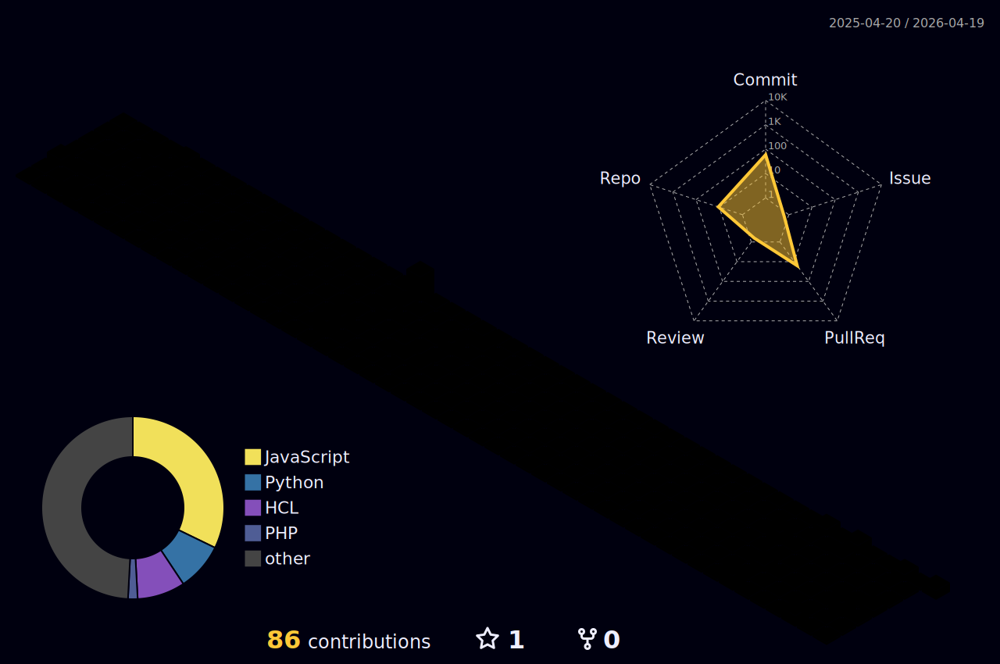

### Kwame

Cloud Infrastructure & DevOps Engineer
AWS · Kubernetes · Terraform · Public Trust Cleared

Based in Katy, TX. Building quietly. Shipping loudly.
[kwamib.dev](https://kwamib.dev)

---

#### Currently

Running a two-node Kubernetes cluster in my home lab. Studying for CKA.
Productizing a US mayors database. Shipping small, often.

#### Selected work

[**aws-k8s-cluster**](https://github.com/Kwamib/aws-k8s-cluster) — Self-managed Kubernetes on AWS. kubeadm, Calico, ArgoCD, NLB, Jenkins CI/CD. Terraform end-to-end.

[**aws-multi-tier-infra**](https://github.com/Kwamib/aws-multi-tier-infra) — Reference VPC architecture. ALB, ECS, RDS, CloudWatch. Modular Terraform.

[**aws-ecs-infra**](https://github.com/Kwamib/aws-ecs-infra) — Container platform on ECS Fargate with full observability.

#### Stack

AWS · Terraform · Kubernetes · ArgoCD · Helm · Jenkins · GitHub Actions · Python · Bash

---

#### Contribution skyline

Regenerates daily. Each building is one day; height is commits. Today burns orange.

---

Built Quietly. Shipped Loudly.
