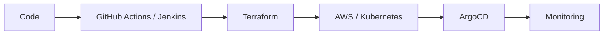

### Kwamib

Cloud Infrastructure & DevOps Engineer
AWS · Kubernetes · Terraform

Building quietly. Shipping loudly.
[kwamib.dev](https://kwamib.dev)

---

#### Currently

Operating a two-node Kubernetes home lab and deepening my cluster administration skills through CKA labs.

Building CivicGrid, a municipal-data platform deployed with Kubernetes, Terraform, ArgoCD, and Cloudflare.

#### Selected Work

[**aws-k8s-cluster**](https://github.com/Kwamib/aws-k8s-cluster) — Provisioned a self-managed Kubernetes platform on AWS using Terraform, kubeadm, Calico, ArgoCD, NLB, RDS, and Jenkins CI/CD.

[**aws-multi-tier-infra**](https://github.com/Kwamib/aws-multi-tier-infra) — Built a production-style AWS architecture with a modular VPC, ALB, Auto Scaling, RDS, EFS, CloudWatch, and Jenkins CI/CD.

[**aws-ecs-infra**](https://github.com/Kwamib/aws-ecs-infra) — Deployed containerized workloads on Amazon ECS with EC2, RDS, NLB, CloudWatch, Inspector, Packer, Jenkins, and Terraform.

[**civicgrid-gitops**](https://github.com/Kwamib/civicgrid-gitops) — Manages CivicGrid’s Kubernetes deployment configuration through ArgoCD and GitOps workflows.

[**DocuMind**](https://github.com/Kwamib/DocuMind) — AI-powered document Q&A platform using Python, RAG, MCP, Angular, and Amazon EKS.

[**enterprise-ops-toolkit**](https://github.com/Kwamib/enterprise-ops-toolkit) — Python and PowerShell automation for infrastructure health checks, log analysis, backup validation, monitoring, and operational reporting.

#### Stack

AWS · Terraform · Kubernetes · ArgoCD · Helm · Jenkins · GitHub Actions · Python · PowerShell · Bash

#### How I Build

```mermaid
flowchart LR
    C[Code] --> CI[GitHub Actions / Jenkins]
    CI --> I[Terraform]
    I --> K[AWS / Kubernetes]
    K --> G[ArgoCD]
    G --> O[Monitoring]
```
